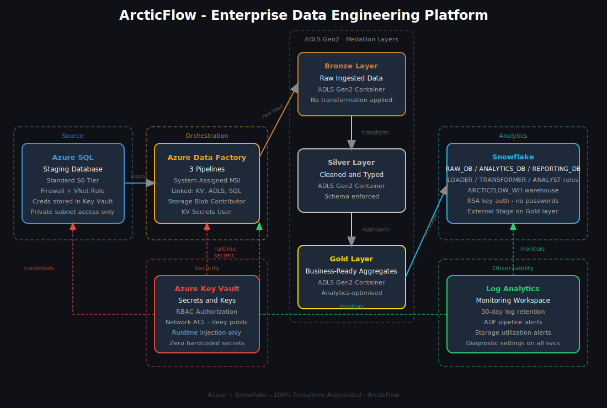

# ArcticFlow

> Enterprise-grade data engineering platform, fully automated with Terraform across Azure and Snowflake.


---

## What Is ArcticFlow

ArcticFlow is a production-grade data engineering platform that provisions and manages a complete cloud data stack using Terraform. Every resource across Azure and Snowflake is defined as code. There are no manual steps, no portal clicks, and no hardcoded secrets anywhere in the codebase.

The platform is built around three core principles:

- **Automation** — one command deploys the entire stack from scratch
- **Security** — secrets, identities, and network access are managed at every layer
- **Observability** — every service ships logs and metrics to a central workspace with alerting configured

---

## Architecture



---

## How the Data Flows

Data starts in an Azure SQL staging database acting as the operational source. Azure Data Factory detects new data and loads it into the Bronze container of ADLS Gen2 without any transformation, preserving the raw record exactly as it arrived.

ADF then runs a second pipeline that reads from Bronze, applies type casting, null handling, and schema enforcement, and writes the result into the Silver container. A third pipeline aggregates the Silver data into business-ready summary tables in the Gold container.

Snowflake sits on top of the Gold layer using an external stage pointed at the ADLS Gen2 endpoint. Analysts query data through Snowflake using role-based access. No analyst can touch raw data. No loader can touch reporting data. Every permission boundary is enforced through Terraform-managed RBAC.

Every credential used across this entire flow is stored in Azure Key Vault. ADF authenticates to storage and Key Vault using a Managed Identity, meaning no passwords exist anywhere in the pipeline.

---

## Infrastructure Modules

### Networking
Provisions a Virtual Network with three dedicated subnets: one for data services, one for private endpoints, and one for compute. A Network Security Group blocks all inbound internet traffic and allows only VNet-internal communication. Service endpoints are configured for Storage, SQL, and Key Vault so traffic stays on the Microsoft backbone.

### Key Vault
Deploys Azure Key Vault with RBAC authorization enabled and a network ACL that denies all public access by default. Secrets for SQL admin credentials, the Snowflake RSA passphrase, and the storage account key are all stored here. ADF and other services pull secrets at runtime using Managed Identities, never at deploy time.

### Storage (ADLS Gen2)
Creates a Storage Account with Hierarchical Namespace enabled, making it a proper Azure Data Lake. Three containers are provisioned representing the medallion layers: Bronze for raw ingestion, Silver for cleaned data, and Gold for aggregated business-ready output. TLS 1.2 is enforced and public blob access is disabled.

### Azure SQL
Provisions a SQL Server and a staging database on the Standard S0 tier. A firewall rule allows local development access and a VNet rule restricts all other access to the private subnet. The admin password is generated and stored directly in Key Vault at provisioning time.

### Azure Data Factory
Deploys ADF with a System Assigned Managed Identity. Three linked services are created automatically: one for Key Vault, one for ADLS Gen2 using the Managed Identity, and one for Azure SQL pulling credentials from Key Vault at runtime. The Managed Identity is granted Storage Blob Data Contributor on the storage account and Key Vault Secrets User on the vault.

### Snowflake
Provisions the full Snowflake analytics layer including a warehouse, three databases (RAW_DB, ANALYTICS_DB, REPORTING_DB), three schemas (BRONZE, SILVER, GOLD), and three account roles with least-privilege grants. The LOADER role can only write to RAW_DB. The TRANSFORMER role can only read from RAW_DB and write to ANALYTICS_DB. The ANALYST role can only read from REPORTING_DB. Authentication uses RSA key pair with no passwords.

### Monitoring
Creates a Log Analytics Workspace with 30-day retention. Diagnostic settings are configured on Key Vault, ADF, and SQL to ship audit logs, pipeline run history, and query metrics. An Action Group routes alerts to a configured email address. Two metric alerts are active: one fires when any ADF pipeline fails, and one fires when storage utilization exceeds 80 percent.

---

## Security Design

| Control                | Implementation                                              |
|------------------------|-------------------------------------------------------------|
| Secret management      | Azure Key Vault with RBAC, no hardcoded values              |
| Service authentication | Managed Identities, no service passwords                    |
| Network isolation      | Private subnets, NSG rules, service endpoints               |
| Snowflake auth         | RSA key pair, password authentication disabled              |
| TLS enforcement        | TLS 1.2 minimum on all Azure services                       |
| Storage access         | Firewall locked to known IPs and VNet subnet                |
| Key Vault access       | Network ACL denies public, allows VNet and known IPs        |
| Role assignments       | All RBAC managed via Terraform, no manual portal grants     |

---

## Snowflake Layer

| Resource  | Name                   | Purpose                                    |
|-----------|------------------------|--------------------------------------------|
| Warehouse | ARCTICFLOW_WH          | Compute for all workloads                  |
| Database  | RAW_DB                 | Holds Bronze schema for raw data           |
| Database  | ANALYTICS_DB           | Holds Silver schema for cleaned data       |
| Database  | REPORTING_DB           | Holds Gold schema for business output      |
| Role      | ARCTICFLOW_LOADER      | Write access to RAW_DB only                |
| Role      | ARCTICFLOW_TRANSFORMER | Read RAW_DB, write ANALYTICS_DB            |
| Role      | ARCTICFLOW_ANALYST     | Read-only access to REPORTING_DB           |

---

## Project Structure

```
arcticflow/
├── main.tf                         # Root orchestration, provider config
├── variables.tf                    # All input variable definitions
├── outputs.tf                      # Stack outputs
├── example.tfvars                  # Safe-to-commit example values
├── modules/
│   ├── networking/                 # VNet, subnets, NSG
│   │   ├── main.tf
│   │   ├── variables.tf
│   │   └── outputs.tf
│   ├── key_vault/                  # Key Vault, secrets, RBAC
│   │   ├── main.tf
│   │   ├── variables.tf
│   │   └── outputs.tf
│   ├── storage/                    # ADLS Gen2, medallion containers
│   │   ├── main.tf
│   │   ├── variables.tf
│   │   └── outputs.tf
│   ├── sql/                        # Azure SQL, firewall, VNet rule
│   │   ├── main.tf
│   │   ├── variables.tf
│   │   └── outputs.tf
│   ├── data_factory/               # ADF, linked services, identity
│   │   ├── main.tf
│   │   ├── variables.tf
│   │   └── outputs.tf
│   ├── snowflake/                  # Warehouse, databases, roles, grants
│   │   ├── main.tf
│   │   ├── variables.tf
│   │   ├── outputs.tf
│   │   └── providers.tf
│   └── monitoring/                 # Log Analytics, diagnostics, alerts
│       ├── main.tf
│       ├── variables.tf
│       └── outputs.tf
├── environments/
│   ├── dev/
│   └── prod/
└── docs/
    └── architecture.svg
```

---

## Prerequisites

- Terraform >= 1.5.0
- Azure CLI >= 2.50.0 authenticated via `az login`
- Azure Pay-As-You-Go subscription
- Snowflake account with RSA key pair configured
- Git

---

## Deployment

```bash
# Clone the repo
git clone https://github.com/Tammyjha470/arcticflow.git
cd arcticflow

# Copy and fill in your values
cp example.tfvars terraform.tfvars

# Initialise providers and backend
terraform init

# Preview what will be created
terraform plan

# Deploy the full stack
terraform apply
```

The full stack takes approximately 10 to 15 minutes to provision on first run.

---

## Environment Outputs

After a successful apply, Terraform prints:

| Output                       | Description                              |
|------------------------------|------------------------------------------|
| `resource_group_name`        | Main Azure resource group                |
| `vnet_id`                    | Virtual network resource ID              |
| `key_vault_name`             | Key Vault name                           |
| `key_vault_uri`              | Key Vault endpoint URI                   |
| `storage_account_name`       | ADLS Gen2 storage account               |
| `storage_primary_endpoint`   | DFS endpoint for data lake access        |
| `sql_server_name`            | SQL Server hostname                      |
| `sql_server_fqdn`            | Fully qualified SQL domain name          |
| `sql_database_name`          | Staging database name                    |
| `data_factory_name`          | ADF instance name                        |
| `data_factory_principal_id`  | ADF Managed Identity object ID           |
| `snowflake_warehouse`        | Snowflake compute warehouse              |
| `snowflake_raw_database`     | RAW_DB name                              |
| `snowflake_analytics_database` | ANALYTICS_DB name                      |
| `snowflake_reporting_database` | REPORTING_DB name                      |
| `log_analytics_workspace_name` | Monitoring workspace name              |

---

## Build Phases

- [x] Phase 0 - Local environment and tooling setup
- [x] Phase 1 - GitHub repo structure and remote state backend
- [x] Phase 2 - Terraform remote state in Azure Storage
- [x] Phase 3 - Networking module
- [x] Phase 4 - Key Vault module with RBAC and secrets
- [x] Phase 5 - Storage module with ADLS Gen2 medallion layers
- [x] Phase 6 - Azure SQL module with staging database
- [x] Phase 7 - Azure Data Factory with Managed Identity and linked services
- [x] Phase 8 - Snowflake module with warehouse, databases and RBAC roles
- [x] Phase 9 - Monitoring module with Log Analytics and alerting

---

## License

MIT
